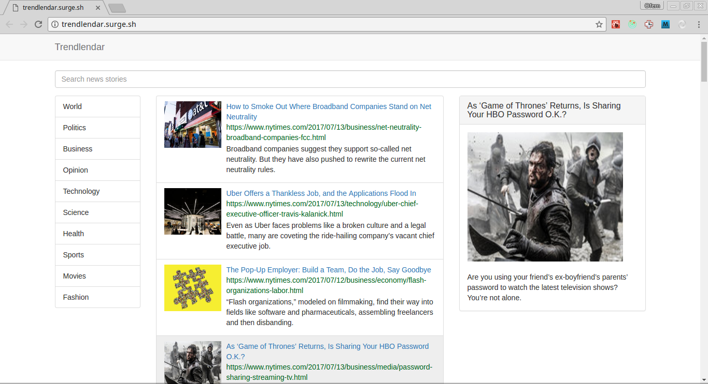

# Trendlendar

### Description
A proof of concept React Redux app using New York Times API


### Demo
A demo of the app can be accessed on [http://trendlendar.surge.sh](http://trendlendar.surge.sh)


### Getting Started

You need to register with the New York Times for an API key.
Go to [https://developer.nytimes.com/signup](https://developer.nytimes.com/signup)
After getting the key change the NYT_API_KEY constant in src/constants.js to reflect your new key.
Then clone the repo and run using the steps below.

#### Familiar with Git?
Checkout this repo, install dependencies, then start the gulp process with the following:

```
	> git clone https://github.com/ofemeteng/trendlendar.git
	> cd trendlendar
	> npm install
	> npm start
```

#### Not Familiar with Git?
Click [here](https://github.com/ofemeteng/trendlendar/archive/master.zip) to download the .zip file.  Extract the contents of the zip file, then open your terminal, change to the project directory, and:

```
	> npm install
	> npm start
```
